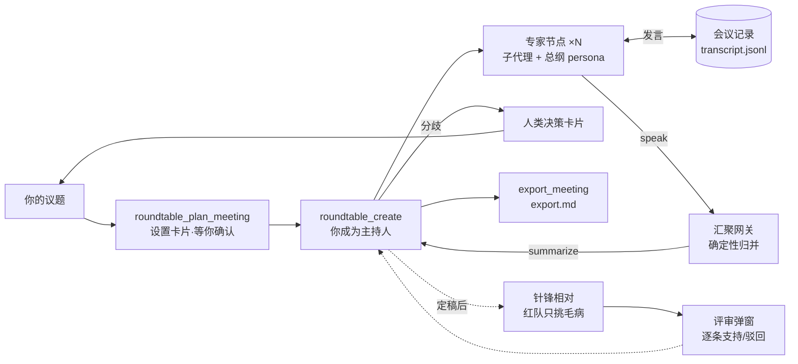

<p align="center">
  <h1 align="center">dsh-plugin-roundtable 圆桌会议</h1>
  <p align="center">把一次 DeepSeek Harness 会话，变成一场可视化、可辩论、可拍板的圆桌会议。</p>
</p>

<p align="center">
  <a href="https://github.com/deepseek-ai/deepseek-harness"></a>
  
  
  
</p>

> **本仓来源**：RoundTable 最初由 [@huanlin（9931666）](https://github.com/9931666/dsh-plugin-roundtable) 开源（MIT），
> 原作者已停止维护；本仓自 **v0.2.35 基线**接手继续开发，独立维护、不回合并上游。
> 详见 [来源与致谢](#来源与致谢)。

---

## 💡 痛点 · 答案

| 一个人的会话 | 圆桌的答案 |
|---|---|
| 一个模型既当选手又当裁判，自己审自己的方案 | **主持人 + 多席专家分工**：DeepSeek 只做主持与汇总，方案由别的席位来挑 |
| 长上下文里堆十份报告，越读越糊 | **汇聚网关**把发言确定性归并，主持人一键拉摘要，上下文不被淹没 |
| 专家结论无从复核，说得像真的 | **证据分级 + 独立验证席**：结论必须给位置/命令/原文，给不出就标「未验证」 |
| 「讨论完了，到底同不同意」没有落点 | **人类决策卡片**：分歧处会议暂停，你选 A/B 或自定义，决策权始终在你 |
| 想反驳自己的方案却不知从何下手 | **针锋相对评审**：定稿后拉红队专挑毛病，逐条「支持/驳回」并留修订对照 |

## ✨ 功能一览

**会议组织**

- 🪑 **左主持 + 右圆桌拓扑** — 会话视图新增「圆桌会议」Tab：主持人锚点、环形专家节点、中央汇聚网关，连线带方向箭头，全程可视化
- 💬 **群聊视图（v0.2.47）** — 同一 Tab 内一键切换「拓扑 / 群聊」：会议发言以 QQ 群聊形态展示（气泡、品牌头像、连续同人合并、轮次分隔），底部输入框可**以主持人身份直接说话**（落盘标 `source: user`，主持人下轮能分辨是谁说的）；拓扑视图与右栏面板完全不受影响
- ⌨️ **空状态就地开局（v0.2.48）** — 「还没有圆桌会议」那一屏也有**同一个**输入框：说一句议题，主持人当场拉起专家队伍（等价于 `/roundtable <议题>`），不必再回聊天窗口绕一圈
- 🎯 **圆桌讨论模式（e 功能）** — 两个入口同一个状态：**打开「圆桌会议」Tab** 或敲 **`/roundtable`**，本会话之后发的每条消息都按圆桌会议处理；`/roundtable off` 或切走 Tab 关闭
- 🧩 **持久子代理专家** — 每位专家都是独立可续聊的子代理，带《全局协作总纲》（目标 / 角色边界 / 协作协议 / 安全红线）入会
- 🔗 **可视化连线** — 悬停拖拽「＋」拉线，右键切换单向/双向或删除，双向通道两端各有一个箭头
- 🏷️ **厂商 Logo 头像** — DeepSeek / GLM / z.ai / Gemini / Claude / Kimi / MiniMax / 千问；未收录厂商回退为「品牌色块 + 缩写」
- 💡 **状态呼吸灯** — 纯 CSS 状态反馈，不消耗任何 Token

**协作与辩论**

- 🎛️ **三种协作模式** — `主持人统筹` 一切经主持人转达；`多模型平等` 专家直达互辩、超预算自动闭麦；`针锋相对` 只对定稿方案挑毛病
- 🧮 **调度面（v0.2.42）** — 每轮提交 `plan[{id, task, owner, depends_on}]`：空依赖=同波并行，非空=1+max 波次；环/悬挂/未知席一律拒绝，**先校验后推进**（非法计划不烧轮）
- 🔍 **计划 vs 实际对账** — `round_signals` 报未派席、未派工作项与越界转派，计划定了没跟到底看得见
- 🧠 **代理思考** — 黑盒干活模型（视频/图片生成等）也有透明思考链：导演模型先写 `[DeepSeek 代理思考]` 再翻译参数
- 🗳️ **人类决策卡片** — 会议暂停、你来拍板，选项来自专家实发输出而非模型臆造

**针锋相对评审（红队）**

- 🎯 **评审全流程** — 定稿方案 → 记录「问题 + 方案」→ 拉红队（只挑毛病、不给替代方案）→ 收集观点 → Web 评审弹窗自动打开
- ☑️ **逐条三态表态** — 每观点独立卡片，可「支持 / 驳回 / 取消」；**驳回必填理由**，理由回流给主持人修订对照
- 🔬 **观点证据分级** — 代码/bug 类附**可复现步骤**，设计类缺陷附**论证链**；观点卡按类型显示证据徽标
- 🔁 **闭环复审（最多 3 轮）** — 修订后再复审，只核对上一轮认定缺陷是否修复；超上限须用户显式批准，防无限循环
- 📄 **Markdown 导出** — 全部轮次/观点/表态/驳回理由/修订对照导出为交付物，可留存或贴进 issue

**成本与状态**

- 🧯 **预算熔断** — 轮数与 Token 双预算，超限自动「闭麦」，可补预算继续或汇总收场
- 📉 **诚实的 Token 口径** — 显示的是**发言文本量**（中文约 0.6 token/字），**不含** system prompt、persona、历史与工具开销，**不等于账单**
- 🔒 **匿名反馈回路** — 结束后 1 键有用度 + 可选一句「最卡的点」，只记模式/模型/轮数/Token/时间戳，**绝不记对话**；可随时查看、清空或关闭
- 🗃️ **知识库摘要缓存** — 主持人读过的 KB 文件按 `path + size + mtimeMs` 记摘要，`status` 标 `[HIT]/[STALE]`，省掉「主持人读一遍 + 专家读一遍」的双倍消耗
- 💾 **持久化** — 会议落在 `<工作区>/.roundtable/<meetingId>/`（meeting / transcript / review / user-actions / kb-digest），重启可恢复

**设置与预设**

- 🧑🤝🧑 **自建角色预设** — 设置 → 圆桌会议 → 角色预设，自己建模板；插件**不预置任何内置角色**
- 🎚️ **模型 · 思考强度** — 点「编辑」表单就长在该条下方，一次改完名称/角色/厂商+模型/**思考强度**；档位名逐字取自宿主，不自造枚举
- ⚙️ **开会前先确认** — 每次开会（哪怕只有一位专家）先弹**设置卡片**：专家名单 + 模式 + 预算 + 知识库 + 选中 skill，确认后才创建
- 🧰 **Skill 接入** — 清单来自 DSH 原生 `ctx.skills`（目录发现，非插件自造）；可选「主持人中转」（省 token）或「专家直接调用」

## 🚀 快速开始

**需要**：[DeepSeek Harness](https://github.com/deepseek-ai/deepseek-harness) **0.1.5-rc.1+**（v0.2.1 起适配 Cordis 4.0.2 / dsh 客户端架构，不再兼容 0.1.1-rc.2）。

```sh
# 从源码装（推荐：本仓不发 npm）
git clone https://github.com/Fishsb/dsh-plugin-roundtable
cd dsh-plugin-roundtable
pnpm install && pnpm build
dsh plugin --profile web add .
```

装完**重启 DSH** → 刷新 Web UI → 设置 → 圆桌会议 能读出默认值即可。

**然后在对话里直接用自然语言开会**：

```text
开个圆桌会议，评审 v0.5 的架构方案，从性能、安全、成本三个角度各安排一位专家，最后给我一份汇总报告。

用多模型平等模式开一场辩论会，议题是「单体 vs 微服务」，每位专家可以互相反驳，最多 3 轮，最后让我拍板。

方案已定稿，开个针锋相对评审，拉两位红队专家专门挑毛病。
```

**或者直接切到讨论模式**（两个入口等价）：

```text
/roundtable                                    # 开启讨论模式：本会话后续消息都按圆桌会议处理
/roundtable 评审 v0.5 的架构方案，重点看性能与安全   # 开启并立刻把议题交给主持人
/roundtable off                                # 关闭

# 另一个入口：直接在 Web UI 里点开「圆桌会议」Tab —— 打开即开启，切走即关闭
```

**从 0.1.1-rc.2 / 旧版升级**：宿主先升到 0.1.5-rc.1+，再装本插件覆盖旧版并重启。历史会议（`.roundtable/`）跨大版本兼容性不保证，重要会议先导出。

## 🧑🤝🧑 专家团：作者实际在用的 28 席

本仓附带作者长期使用后收敛的完整专家名单，见 **[`EXPERTS.md`](./EXPERTS.md)**（含每席完整角色定义与分组说明）与 **[`experts.yaml`](./experts.yaml)**（可直接粘进 `settings.yaml`）。

| 分组 | 席位数 | 这一组解决什么 |
| --- | --- | --- |
| 澄清与立项 | 3 | 先把「要做什么、值不值得做」问清楚 |
| 方案成型 | 5 | 摆成可比矩阵、做减法、找现成的、再收敛 |
| 攻防与质疑 | 3 | 对定稿方案找真问题：结构性隐患、未言明前提、极端输入 |
| 工程专项 | 9 | 结构 / 落地 / 性能 / 安全 / 数据 / 依赖 / 维护 / 可观测 / 技术债 |
| 验证与取证 | 5 | 判据先立、缺陷能复现、事实有出处、与基线对照 |
| 视角与交付 | 3 | 换到使用者一侧看，排出时间线，组织成交付文档 |

用法：把 `experts.yaml` 的内容粘进 `~/.dsh/settings.yaml` 的 `roundtable.rolePresets` 下，重启 DSH 即出现在设置页；开会时主持人用 `roundtable_list_presets` 读取并按需上席。也可以只挑几席——删掉不需要的条目即可。

> `EXPERTS.md` 与 `experts.yaml` 由 `scripts/export-experts.mjs` 从磁盘真相直出，**禁止手写**；漂移检查 `node scripts/export-experts.mjs --check`。

## 🔄 工作原理



**单一出口原则（v0.2.36 起）**：专家的正文**不能**直接回传主会话——回传通道在插件层被物理封死，产出只能经 `roundtable_speak` 写入会议记录，主持人再从记录汇总。这不是限制，而是把「十份报告淹掉主会话」变成「账本 + 一次汇总」。

## 🎛️ 协作模式

| | 主持人统筹 `orchestrated` | 多模型平等 `egalitarian` | 针锋相对 `redteam` |
| --- | --- | --- | --- |
| 主持人角色 | 决定谁发言、转达观点、语义仲裁 | 退居发牌 + 计时 + 裁判 | 记录议题与方案、收集红队观点 |
| 专家之间 | 都经由主持人 | 直达消息互相辩论 | 都经由主持人 |
| 连线含义 | 协作关系声明 | 允许互发消息的通道 | 协作关系声明 |
| 终止方式 | 主持人判断完成 | 轮数 / Token 预算超限自动闭麦 | 主持人判断完成 |
| 隔离性 | 信息隔离（互不知晓） | 公开名册（可广播） | 信息隔离 |

选择「多模型平等」时界面会要求填安全限制（最大轮数、最大 Token），超限即闭麦暂停。选择「针锋相对」时总纲自动附加红队评审协议（只挑毛病、不给替代方案）。

## ⚙️ 配置

Profile 可覆盖（默认开箱即用）：

```yaml
- id: roundtable
  name: 'dsh-plugin-roundtable'
  config:
    stateDir: .roundtable        # 会议状态目录（工作区下）
    memberProvider: spawn        # 专家节点子代理后端（spawn / fork）
    maxNodes: 8                  # 单场会议专家上限
    defaultMode: orchestrated    # 默认协作模式
    memberMaxDepth: 1            # 专家再委派深度上限
    promptSectionOrder: 116      # 使用策略提示段顺序
```

运行时偏好在「设置 → 圆桌会议」中修改，持久化到 `settings.yaml`：

| 偏好 | 默认 | 说明 |
| --- | --- | --- |
| 默认协作模式 | `orchestrated` | 主持人统筹 / 多模型平等 / 针锋相对 |
| 最大轮数 / 最大 Token | 10 / 200000 | 会议预算，超限闭麦 |
| 互通开关 | 开 | 只看当前对话会议 / 看全部 |
| 专家每轮输出上限（token） | 0（不限制） | 专家组模型 `max_tokens` |
| 专家每轮最多意见数 | 0（不限制） | 专家 prompt 约束 |
| 反馈开关 | 开 | 结束后是否询问 1 键有用度 |
| skill 传递方式 | 主持人中转 `relay` | 主持人读后转交 / 专家自行用 `skill` 工具 |
| 右栏面板显示 | 全开 | 专家 / 分工 / 知识库 / 已选 skill / 发言记录 / 分针记录 / 产出文件 |

## 🧰 工具一览（模型可见协议，23 个）

| 工具 | 作用 |
| --- | --- |
| `roundtable_plan_meeting` | **开会第一步**：出设置卡片（专家 + 全部参数 + skill），阻塞等确认；返回 `approved` / `revise`。**不创建会议** |
| `roundtable_create` | 建会，调用者成为主持人（支持 `kb_path` / `skills` / `skill_delivery`） |
| `roundtable_add_node` / `remove_node` | 增删专家（可续聊子代理 + 总纲 persona）；`add_node` 可带 `preset` / `reasoning_effort` |
| `roundtable_list_presets` | 读用户自建角色预设（id/name/role/路由/档位），支持子串过滤 |
| `roundtable_connect` / `disconnect` | 建 / 删连线（单向 / 双向） |
| `roundtable_next_round` | 推进轮次 + 提交本轮**调度计划**（`plan[{id,task,owner,depends_on}]`）；≥2 席时计划必填 |
| `roundtable_speak` | 发言写入会议记录（可定向，不填交网关） |
| `roundtable_send_message` | 直达消息（平等模式专家互辩；可带 `work_item` 供对账） |
| `roundtable_summarize` | 拉取汇聚网关结构化摘要 |
| `roundtable_status` | 会议全景（节点活动、连线、预算、待决策、待办行为、知识库缓存命中、`talent_pool`、`round_signals`） |
| `roundtable_request_decision` | 暂停会议、请求人类决策 |
| `roundtable_actions_clear` | 清空用户待办行为记录；返回 `{cleared, malformed}`，`malformed > 0` 表示有操作因坏行丢失、必须告知用户 |
| `roundtable_set_budget` | 调整预算 / 闭麦恢复 |
| `roundtable_proxy_think` | 代理思考：为黑盒模型做思考铺垫 + 参数翻译 |
| `roundtable_start_review` | 发起针锋相对评审（首轮 `reviewPass=1`；再调=复审，上限 3，超限须 `user_approved_extra_pass=true`） |
| `roundtable_collect_review` | 收集红队发言为观点（LLM 拆分含证据分级，失败本地兜底），打开评审弹窗 |
| `roundtable_finish_review` | 结束本轮评审（→ done），附修订说明 |
| `roundtable_export_review` | 导出完整评审记录为 Markdown |
| `roundtable_export_meeting` | 导出**整场会议**为 Markdown，并写入 `<meetingDir>/export.md` |
| `roundtable_kb_digest` | 记下 KB 文件要点摘要（`size`/`mtime` 作失效键），下次 `status` 显示 `[HIT]` 即可复用 |
| `roundtable_close` | 结束会议（记录保留） |

## 🧭 界面

**两个入口，同一个「圆桌讨论模式」**（状态按会话记，打开聊天框输入 `/roundtable` 即可见开关状态）：

- **聊天** — 自然语言触发即可；模式开启后，本会话的每条消息都自动按圆桌会议处理
- **`/roundtable` 斜杠命令** — 敲命令即开启讨论模式；`/roundtable off` 关闭；`/roundtable 议题…` 开启并把议题直接交给主持人
- **「圆桌会议」Tab** — 打开该 Tab 等于开启讨论模式（切走即关），另含**两个视图**（顶部切换条）：
  - **拓扑**（默认）— 实时拓扑图 + 调度面板（波次/对账/缺口/候选池）+ 预算进度 + 网关摘要 + 发言时间轴 + 模式徽章
  - **群聊**（v0.2.47）— QQ 群聊形态的发言流（气泡 / 品牌头像 / 连续同人合并 / 日期与轮次分隔）+ 底部输入框（Enter 发送、Shift+Enter 换行），可**以主持人身份直接往会议里说一句**
- **设置页** — 默认模式、预算默认值、专家回答限制、skill 传递方式、右栏面板显示、自建角色预设

> 视图切换状态**不落盘**（与讨论模式同理）：这是"此刻在看什么"的交互意图，不是配置。
> 群聊只显示已有发言；**原话完整呈现**（快照轮询里那份 20 条 / 90 字截断的是侧栏时间轴，不是群聊）。
> 输入框发出的消息落成 `nodeKey=captain` + `source=user` 的一条发言，**不计入会议预算**（用户发言不消耗专家轮次与 token）。
> **还没有会议时**，那一屏的输入框用的是同一个组件，但语义不同：它把议题交给主持人**开一场会议**（等价 `/roundtable <议题>`），而不是往某个会议里发言。

> 模式的**有效值 = tab 来源 ∨ 命令来源**，两者互不覆盖：切走 Tab 只撤自己那一份，命令开的模式仍生效。
> 状态是进程内存储，**重启 DSH 或热重载插件后清零** —— 重新打开 Tab 或再敲一次 `/roundtable` 即可。

## ⚠️ 使用边界与注意事项

- **一个主持人同一时间只能带一场活动会议**：新开会前先 `roundtable_close`
- **专家是回合制子代理**：消息唤醒 → 干一整轮 → 空闲；「辩论」是消息驱动的异步轮流对话，不是实时并发
- **子代理的最终回复不可被程序直接读取**：专家必须经 `roundtable_speak` 写入记录——这是协议约束，不是 bug
- **设置卡片没有富表单**：原生 `userQuestions` 只有「选项列表 + 一个自由文本框」，所以「可改全部」是靠**自由文本 + 回流重建**实现（写明改动 → 主持人重出草案再确认）
- **skill 由 DSH 原生发现**：插件不做导入动作，只读 `ctx.skills`；导入 = 把 skill 文件放进官方目录。宿主未挂载 skill 服务时清单为空，`direct` 模式自动降级
- **会议已选 skill 在创建时固化**：中途无法改会议 skill 清单，需要新资料时走 `relay` 路径
- **人类决策依赖 `userQuestions` 服务**：缺失时卡片返回 `decision="unavailable"`，主持人改用文字确认
- **状态为文件级持久化**：单 DSH 进程内串行操作；**多进程同时改同一会议不保证一致**
- **讨论模式状态不落盘**：重启 DSH 或热重载插件后回到「关」，重新打开「圆桌会议」Tab 或再敲一次 `/roundtable` 即可恢复
- **删会议 = 删整个 `.roundtable/<id>/` 目录**：不可恢复
- **群聊里的发言不可编辑/撤回**：`transcript.jsonl` 是 append-only 追加日志，本版不做改写语义（撤销需求请走会议导出后的文本处理）
- **群聊数据源是会议发言，不是真实 QQ 群**：`ChatView` 是纯展示组件、取数在父级，将来接真 QQ（OneBot/NapCat 一类协议端）时界面层不需返工
- **第三方模型要显式指定**：拉 zai / GLM 等厂商专家时写明 provider/model（如 `zai/glm-5.2`），否则可能路由失败

### 已知限制

| 限制 | 影响 | 现状 |
| --- | --- | --- |
| **跨 Session 越权** | RPC 通道不暴露调用者 session 身份，同进程内其他会话知道会议 id 理论上即可调用其读写端点。现有防线是「归属校验 + 状态机校验」，**不是身份校验** | **本版接受现状**：单人 / 单工作区无实际影响。多人共用同一实例时请视为同一信任域 |
| Host 侧并发写竞态 | 插件生命周期事件与会议文件写并发时理论上可能交错 | 已知风险暂缓；单进程内写操作已由 `withMeetingLock` 串行化 |

## 🛠️ 开发

```sh
pnpm install
pnpm typecheck    # 双端 tsc：host（tsconfig.json）+ client（tsconfig.client.json）
pnpm test         # 零依赖 node --test：Node 原生剥离类型，直接 import src/*.ts
pnpm build        # typecheck + tsdown（lib/index.js + lib/client.js）+ 双端 .d.ts
pnpm test:inline  # 同上，但测试在同一进程内跑（不 spawn 子进程 / 不占管道）

node scripts/generate-logos.mjs    # 替换 src/client/assets/logos/ 下图片后重跑，再 pnpm build
node scripts/export-experts.mjs    # 从 settings.yaml 直出 EXPERTS.md 与 experts.yaml
node scripts/export-experts.mjs --check   # 只校验专家团与磁盘真相是否一致
```

> `pnpm test` 用 Node 标准测试运行器（每个测试文件一个子进程）。在**禁止子进程管道**的环境里（例如 DSH 自带沙箱）会以 `spawn EPERM` 失败——那是环境限制，不是测试失败；改用 `pnpm test:inline`（需 Node ≥ 22.8）。

维护说明与本地部署链见 [`LOCAL-MAINTENANCE.md`](./LOCAL-MAINTENANCE.md)。

## 📜 来源与致谢

- **上游**：RoundTable 最初由 [@huanlin](https://github.com/9931666) 创作并开源，仓库 [`9931666/dsh-plugin-roundtable`](https://github.com/9931666/dsh-plugin-roundtable)，采用 MIT 许可
- **接手**：原作者已停止维护（最后推送 2026-09-13，唯一 issue 长期无回复），本仓自其 **v0.2.35** 基线接手继续开发
- **本仓独立演进**（不回合并上游、不依赖上游更新）：预设装配链、主持人单一出口、成员感知同步、调度面与调度面板、角色预设模型·思考强度贯通等
- 原始 MIT 版权声明与许可条款完整保留，见 [`LICENSE`](./LICENSE)；上游贡献者署名保留于 `package.json` 的 `contributors`
- 上游历史发布说明留存于 [`release-notes/`](./release-notes)（v0.2.0 起，供追溯）

**问题与建议请提到本仓 [Issues](https://github.com/Fishsb/dsh-plugin-roundtable/issues)**，不要提到上游。

## 📄 许可证

[MIT](./LICENSE) © 2026 dsh-plugin-roundtable contributors
